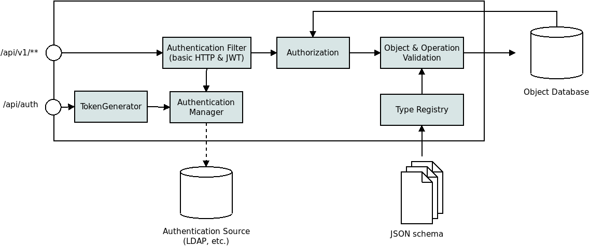

# API Server

Experiment on implementing an API server on the model of Kubernetes.

Features:
- object validation base on Json schema placed in an external folder
- authorization based on ClusterRole/ClusterRoleBinding/Role/RoleBinding objects
- authentication using ServiceAccount and Secret
- produces JWT tokens
